<h1 align="center">Keto 4 Me</h1>
<span id="keto4me"></span>

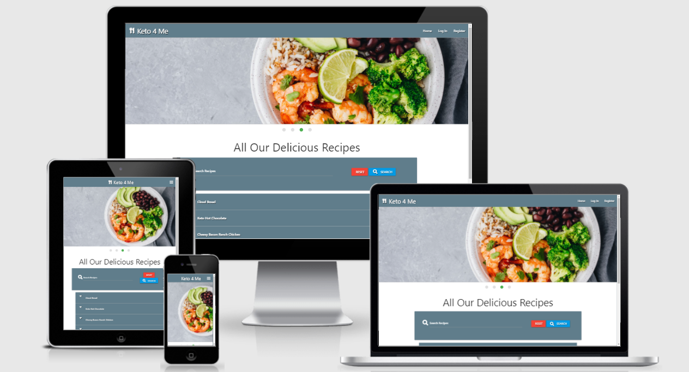

Keto 4 Me is a diet recipe website. Everyone knows dieting isn't easy. Recipes are hard to find. Are they tasty enough for you? Will it impact my diet? All questions which people ask themselves when searching the internet.  

Keto 4 Me is a website for people who are on the Keto diet. This website is a place where people on the diet can get inspired, search for tasty recipes and post their favourite recipes also to the community on the diet. 

Keto 4 Me is designed to inspire people for tasty meal ideas. Everyone is welcome to create an account and add their Keto recipes. If the user has an account, he/she can add, edit and delete their recipes. 

This project is the third out of four Milestone Projects in the Full Stack Web Development Program I am attending at The Code Institute.

**[View the live project here.](https://keto4me.herokuapp.com/)**

---

## Index 

- <a href="#ux">1. User experience (UX)</a>
  - <a href="#ux-goals">1.1. Project goals</a>
  - <a href="#ux-stories">1.2 User stories</a>
  - <a href="#ux-design">1.3 Design</a>
  - <a href="#ux-architecture">1.4 Information architecture</a>
  - <a href="#ux-mockup">1.5 Mockup designs</a>
- <a href="#features">2. Features</a>
  - <a href="#features-existing">2.1 Existing features</a>
  - <a href="#features-future">2.2 Features left to implement in the future</a>
- <a href="#technologies">3. Technologies used</a>
- <a href="#testing">4. Testing</a>
- <a href="#deployment">5. Deployment</a>
- <a href="#credits">6. Credits</a>
- <a href="#Acknowledge">7. Acknowledge</a>
- <a href="#Acknowledge">8. Disclaimer</a>

---

<span id="ux"></span>

<h1>1. User experience (UX)</h1>

<span id="ux-goals"></span>

### 1.1 Project goals 

- Making a full-stack site that allows users to manage a common dataset about a particular domain. 
- Making a full-stack site that uses HTML, CSS, JavaScript, Python+Flask and MongoDB.

- Creating a website that serves as a platform where people can get inspired for keto ideas and where they can share their keto recipes. 
- Creating a website that is simple to understand and easy to navigate.
- The users of the website can make use of CRUD (create, read, update and delete) for the recipes listed. 

<span id="ux-stories"></span>

### 1.2 User stories 

**First-time visitor goals:**
1. As a first time visitor, I want to be able to visit the website on every device, so that I can look at the website on desktop, mobile and tablet. 
2. As a first time visitor, I want to be able to navigate easily through the website, so I can find everything easily. 
3. As a first time visitor, I want to see an overview of all recipes, so I can get inspired by all recipes.
4. As a first time visitor, I want to be able to search recipes by categories, so I can quickly scan the recipes by category. 
5. As a first time visitor, I want to be able to search recipes based on words, so I can find recipes easily. (For example, I can search the word avocado and all recipes with the ingredient Avovado or avocado in the recipe name will appear.)
6. As a first time visitor, I want to register an account on the website, so I can share my recipes on Keto 4 Me. 

**Site member goals:** 

All the goals of first-time visitors also apply for site members. There are additional user stories to the site members because they have more access to the website. See the additional user stories below. 
1. As a site member, I want to add my recipes, so I can share my recipes. 
2. As a site member, I want to edit my recipes, so I can update information in the recipe.
3. As a site member, I want to delete my recipes, so I can remove the recipe when it is no longer relevant. 
4. As a site member, I want to login to my profile, so I have access to my recipes. 
5. As a site member, I want to logout of my profile, so I am no longer active in a session on the website. 


**Admin goals:**

All the goals of the first time visitors and site members also apply for the admin. The admin has additional user stories to manage the categories of the recipes. 
1. As an admin, I want to add new categories, so I can make the categories clear and manageable. 
2. As an admin, I want to edit categories, so I can update categories. 
3. As an admin, I want to delete categories, so I can remove categories when they are no longer relevant. 
4. I want my users to have a very simple and straight forward approach to my website. 
5. I want them to be able to easily navigate the website.
6. I want them to upload their own recipes. The more recipes that are on the website, the more visitors there'll be

<span id="ux-design"></span>

### 1.3 Design 

- #### Colour scheme 
The two colours that are used for the recipe website are very neutral and simple. I have chosen these colours because the colours give a sleek and uncluttered appearance. 

 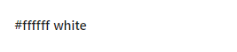 

- **The blue-grey colour** is used for the header, footer background, the flash messages background and the recipes container box. 
- **The black colour** is used on some of the text headers and also in the recipes. 
- **The white colour** is used for the majority of the text when it's placed on the blue-grey background giving a very clean and easy to read website

- #### Fonts
The **Sans Serif** font is used throughout the whole website. 

- #### Icons
In the project, icons are used that are provided by [Font Awesome](https://fontawesome.com/). The Icons that are used have functional purposes such as the hamburger menu and social media icons. 

- #### Images
The images I used for this project came from [Delish](https://www.delish.com//), and also [BBC recipe website](https://www.bbc.co.uk/food/recipes). Images are used on all the recipes and also for the hero image box which rotates 4 images. 

 #### Defensive design 

    - The user is not able to break the site by clicking on buttons. 
    - The signup form: 
        - The username has to be between 5-15 characters and only must contain letters and numbers. 
        - The password has to be between 5-15 characters and only must contain letters and numbers.
    - The add and edit recipe form:
     - The recipe name has to be between minumum 5 characters and only must contain letters and numbers
        - The category has to be chosen.
        - The number of serves and prepping time has to be numbered.
    - A recipe can't be deleted by just one click. If someone clicks on the delete button, there wil be a pop up with a confirmation if someone is sure to delete the recipe.

#### Interactive design 

    - The website has to be easy to navigate. 
    - The user can quickly find the information he/she wants to find. 

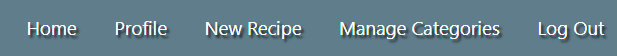

<span id="ux-architecture"></span>

### 1.4 Information architecture
The project has three collections in the database. The database structure in MongoDB is as follows: 

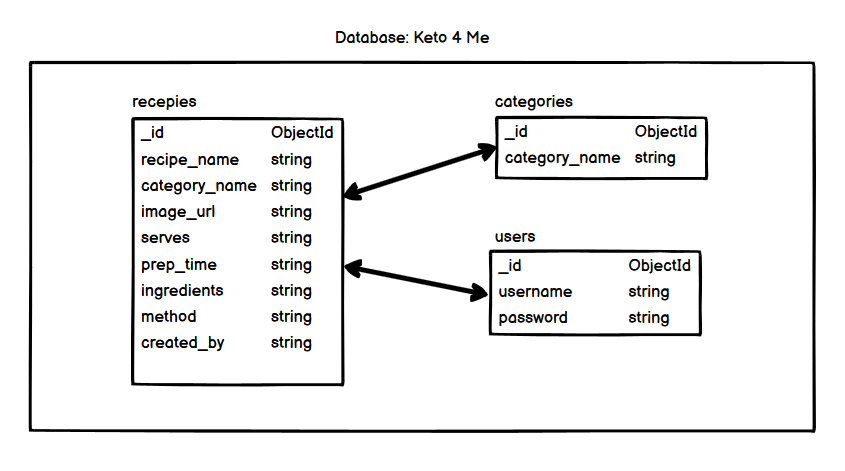

<span id="ux-mockup"></span>

### 1.5 Wireframe designs
Wireframe designs are made with [Balsamiq](https://balsamiq.com/)

All wireframes can be viewed below<br>
PC View

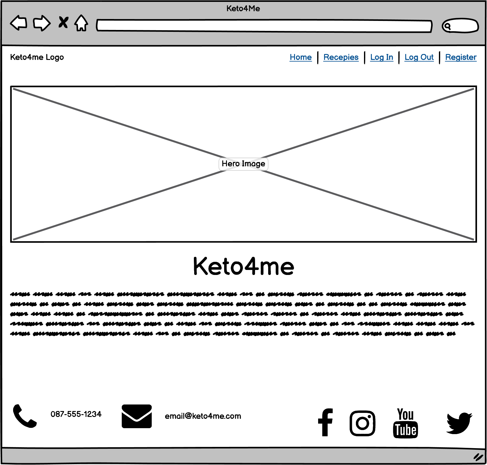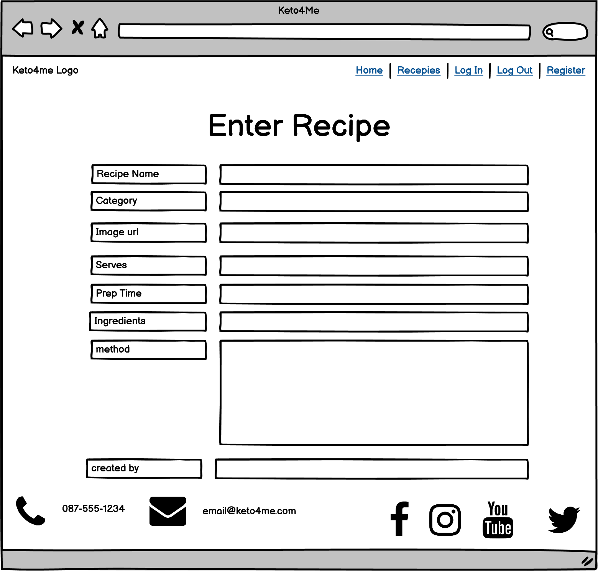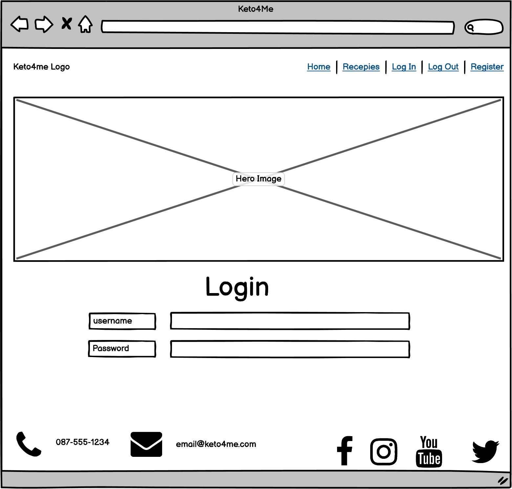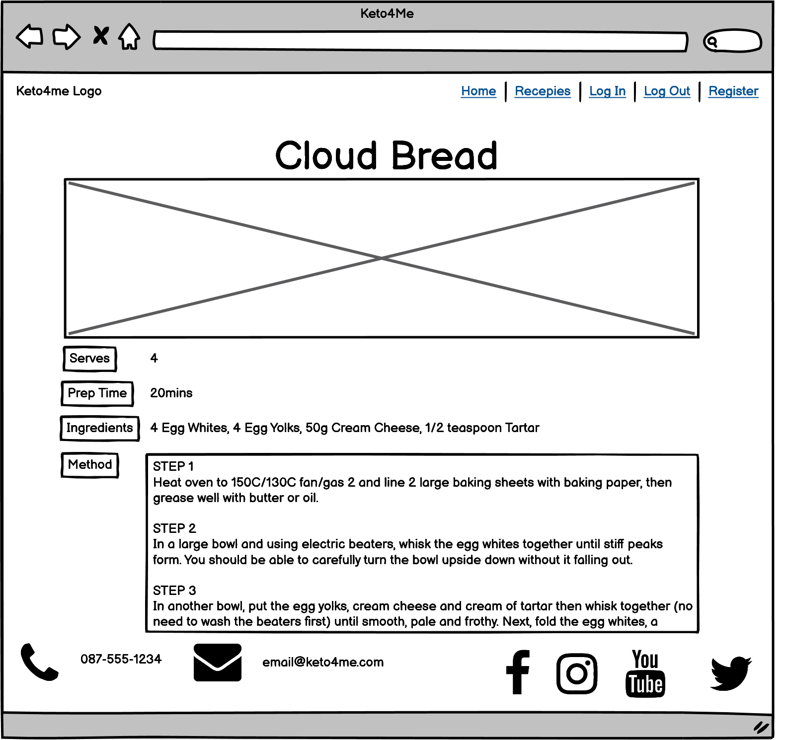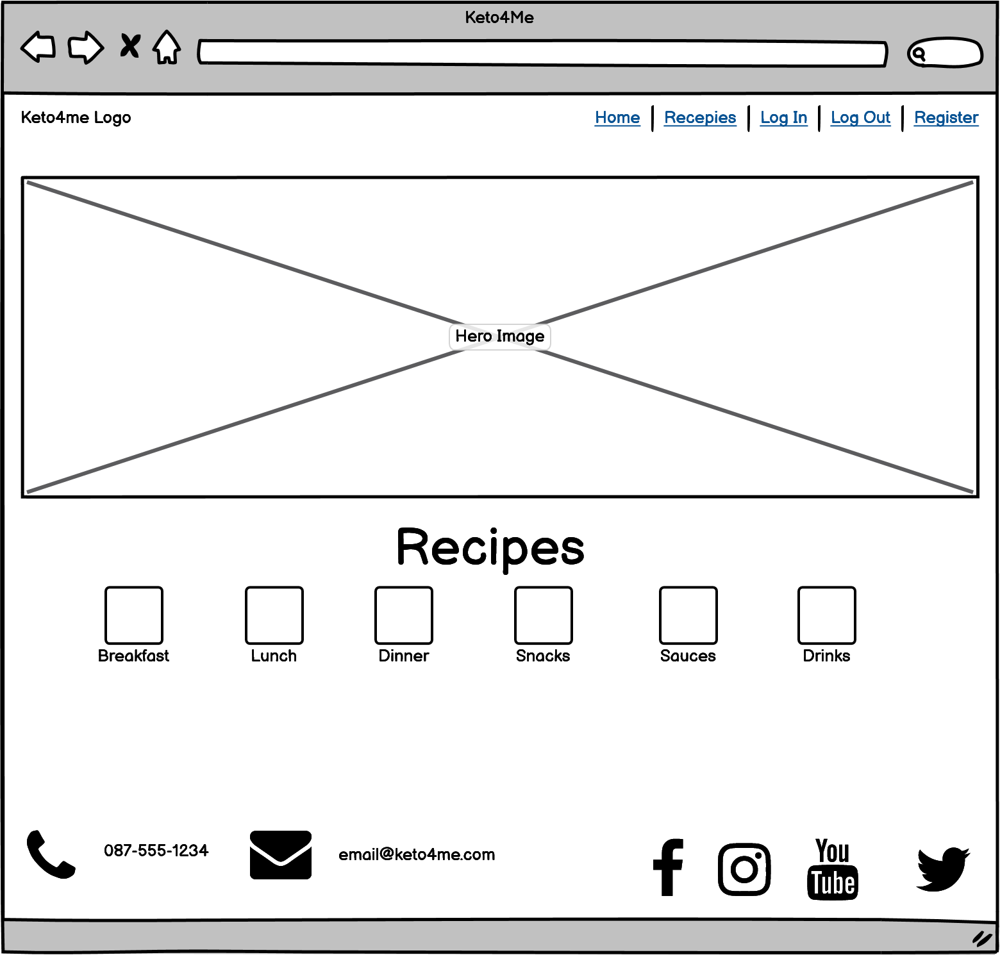<br>

Tablet View

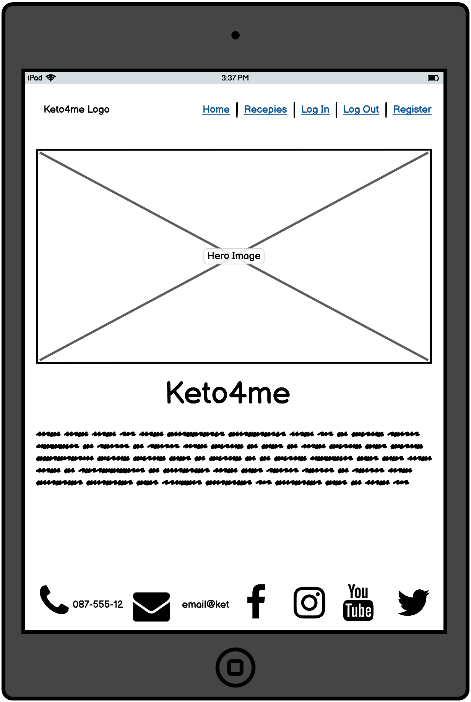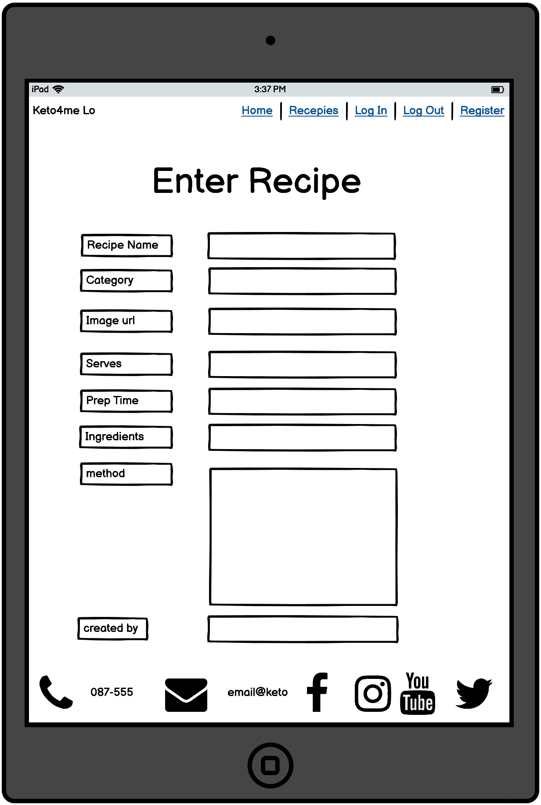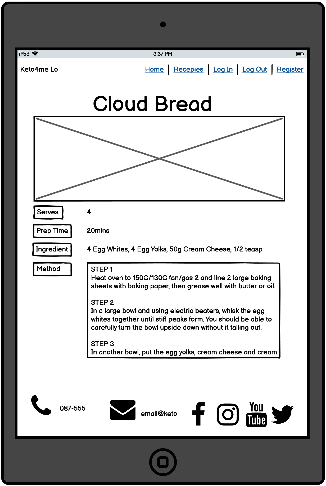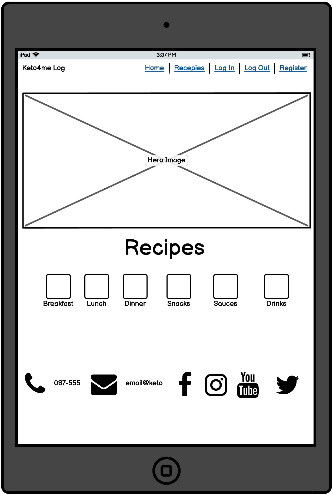<br>

Mobile View

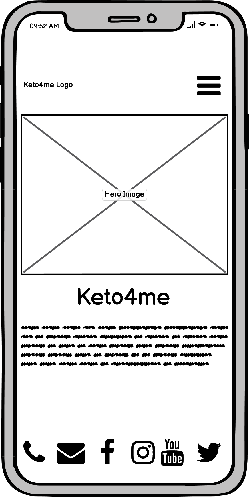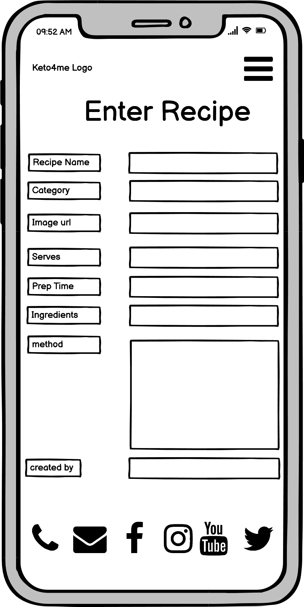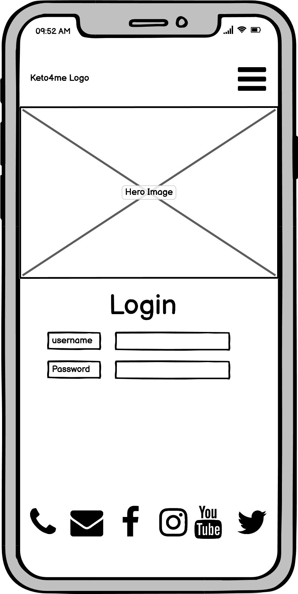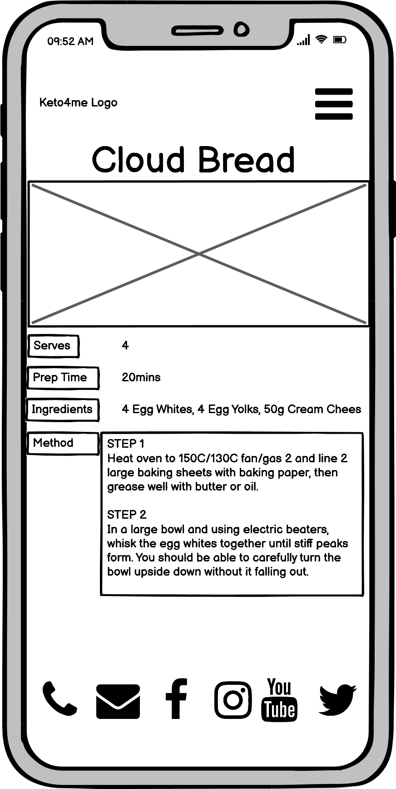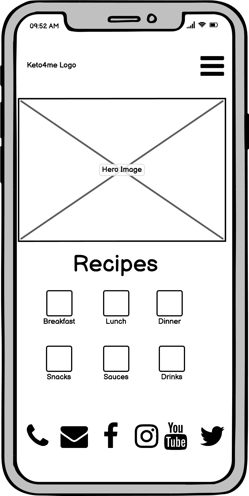<br>

<span id="features"></span>

<h1>2. Features</h1>

<span id="features-existing"></span>

### 2.1 Existing features 

#### 1. Design 
- An attractive and simple layout with consistency.
- Simple navigation throughout the website by using the navigation bar and side nav on mobile devices. 
- Showing the recipes simply and clearly

#### 2. General 
- The home page shows a gallery of 4 rotating images along with all recipes that have been submitted together with simple search function
- There are links to the social media platforms in the footer of the website.  

#### 3. Recipes
- Recipes can be created, read, updated and deleted (CRUD) by the users. 
- People can search for recipes with the search bar. 
- Users have access to their profile, with an overview of all their recipes submitted with CRUD functionality. 
- Recipes include ingredients, method, prepping time and serves.

#### 4. Signup, login and logout 
- People can create a new account on the web application. 
- People can login with their existing accounts. 
- People can easily log out.
- If a person creates a new account, logs in or logs out, a flashed message will appear with the action the person has done. 
- There are also defenses in place so people cannot force themselves onto a restricted page. 

<span id="features-future"></span>

### 2.2 Features left to implement in the future 
- Adding a favorite section. Users can favorite a recipe and see them on their favorite page. 
- On the overview of recipes multiple pages with all recipes, put into their categories, instead of a long list of all recipes. 
- For an image of the recipe, users have to fill in the image URL. For the future, there also can be an option to upload the image. 
- Add form validation on the backend.
- The user can delete their profile.

<span id="technologies"></span>

<h1>3. Technologies used</h1>

#### Languages used
- [HTML5](https://en.wikipedia.org/wiki/HTML5)
    - HTML5 provides the structure and the content for my project. 
- [CSS3](https://en.wikipedia.org/wiki/Cascading_Style_Sheets)
    - CSS3 provides the style of the HTML5 elements.
- [jQuery](https://jquery.com/)
    - jQuery used as the JavaScript functionality.
- [Python](https://www.python.org/)
    - Python provides the backend of the project.

#### Frameworks, libraries & Other
- [Gitpod](https://www.gitpod.io/) 
    - GitPod is used to develop the project.
- [Git](https://git-scm.com/)
    - The Git was used for version control to commit to Git and push to GitHub.
- [GitHub](https://github.com/)
    - The GitHub is used to host the project.
- [Balsamiq](https://balsamiq.com/)
    - Balsamiq is used to create the wireframe designs for the project.
- [Materialize](https://materializecss.com/)
    - Materialize is used for the design framework.
- [MobgoDB](https://www.mongodb.com/1)
    - MongoDB is the fully managed cloud database service used for the project.
- [Heroku](https://dashboard.heroku.com/)
    - Heroku is the cloud platform to deploy the app.
- [Flask](https://flask.palletsprojects.com/en/1.1.x/)
    - Flask is the web framework used to provide libraries, tools and technologies for the app.
- [Jinja](https://jinja.palletsprojects.com/en/2.11.x/)
    - Jinja is used for templating Python
- [Werkzeug](https://werkzeug.palletsprojects.com/en/1.0.x/)
    - Werkzeug is used for password hashing authentication and autohorization.

#### Testing tools used 
- [Chrome DevTools](https://developers.google.com/web/tools/chrome-devtools/open) is used to detect problems and test responsiveness.
- [W3C Markup Validation Service](https://validator.w3.org/)
    - The W3C Markup Validation Service is used to check whether there were any errors in the HTML5 code. 
- [W3C CSS validator](https://jigsaw.w3.org/css-validator/)
    - The W3C CSS validator is used to check whether there were any errors in the CSS3 code.
- [JShint](https://jshint.com/)
    - JShint is a JavaScript validator that is used to check whether there were any errors in the JavaScript code. 
- [PEP8](http://pep8online.com/)
    - The PEP8 validator is used to check whether there were any errors in the Python code.

<h1>4. Testing</h1>

The testing process can be found [here](Testing.md).

<span id="deployment"></span>

<h1>5. Deployment</h1>

#### Requirements 
- Python3 
- Github account 
- MongoDB account 
- Heroku account

#### Clone the project 
To make a local clone, follow the following steps. 
1. Log in to GitHub and go to the repository. 
2. Click on the green button with the text **“Code”.**
3. Click on **“Open with GitHub Desktop”** and follow the prompts in the GitHub Desktop Application or follow the instructions from **[this link](https://docs.github.com/en/free-pro-team@latest/github/creating-cloning-and-archiving-repositories/cloning-a-repository#cloning-a-repository-to-github-desktop)** to see how to clone the repository in other ways. 

#### Working with the local copy
1. Install all the requirements: Go to the workspace of your local copy. In the terminal window of your IDE type: **pip3 install -r requirements.txt**.
2. Create a database in MongoDB  
    - Signup or login to your MongoDB account.
    - Create a cluster and a database.
    - Create four collections in the db: **categories, recipes, users.**
    - Add string values for the collections. See <a href="#ux-architecture">my Information architecture</a> how the database is set up for this project.
3. Create the environment variables 
    - Create a .gitignore file in the root directory of the project.
    - Add the env.py file in the .gitignore.
    - Create the file env.py. This  will contain all the envornment variables.
    ```
    Import os
    os.environ.setdefault("IP", "Added by developer")
    os.environ.setdefault("PORT", "Added by developer")
    os.environ.setdefault("SECRET_KEY", "Added by developer")
    os.environ.setdefault("MONGO_URI", "Added by developer")
    os.environ.setdefault("MONGO_DBNAME", "Added by developer")
    ```
4. Run the app: Open your terminal window in your IDE. Type python3 app.py and run the app.

#### Heroku Deployment  
1. Set up local workspace for Heroku 
    - In terminal window of your IDE type: **pip3 freeze -- local > requirements.txt.** (The file is needed for Heroku to know which filed to install.)
    - In termial window of your IDE type: **python app.py > Procfile** (The file is needed for Heroku to know which file is needed as entry point.)
2. Set up Heroku: create a Heroku account and create a new app and select your region. 
3. Deployment method 'Github'
    - Click on the **Connect to GitHub** section in the deploy tab in Heroku. 
        - Search your repository to connect with it.
        - When your repository appears click on **connect** to connect your repository with the Heroku. 
    - Go to the settings app in Heroku and go to **Config Vars**. Click on **Reveal Config Vars**.
        - Enter the variables contained in your env.py file. it is about: **IP, PORT, SECRET_KEY, MONGO_URI, MONGO_DBNAME**
4. Push the requirements.txt and Procfile to repository. 
     ```
    $ git add requirements.txt
    $ git commit -m "Add requirements.txt"

    $ git add Procfile 
    $ git commit -m "Add Procfile"
    ```
5. Automatic deployment: Go to the deploy tab in Heroku and scroll down to **Aotmatic deployments**. Click on **Enable Automatic Deploys**. By **Manual deploy** click on **Deploy Branch**.

Heroku will receive the code from Github and host the app using the required packages. 
Click on **Open app** in the right corner of your Heroku account. The app wil open and the live link is available from the address bar. 

<span id="credits"></span>

<h1>6. Credits</h1>

#### Recipes
- Cloud Bread - [BBC Food Recipes](https://www.bbcgoodfood.com/recipes/cloud-bread) BBC website. 
- Keto Hot Chocolate - [Delish.com](https://www.delish.com/cooking/nutrition/a29369044/keto-hot-chocolate-recipe/)
- Cheesey Bacon Ranch Chicken - [Delish.com](https://www.delish.com/cooking/recipe-ideas/a27156187/cheesy-bacon-ranch-chicken-reipe/)
- Boursin Stuffed Chicken - [Delish.com](https://www.delish.com/cooking/recipe-ideas/recipes/a45906/boursin-stuffed-chicken-recipe/)


#### Media 
Images used on the website have been taken from [Delish.com](https://www.delish.com/) [The BBC Food Website](https://www.bbc.co.uk/food/recipes)

#### Code
- [Flask error handling - Python on the web - Learning Flask ep. 18](https://www.youtube.com/watch?v=mBKKZN1MMBM)

<span id="Acknowledge"></span>

<h1>7. Acknowledge</h1>

Thanks to the following people and organizations who helped or inspired me for the project:  
- The support and guidance of my mentor Precious Ijege. 
- The lessons and knowledge of [Code Institute.](https://codeinstitute.net/)
- The advice from Sean at the Tutor Assistance in Code Institute.

<span id="Disclaimer"></span>

<h1>8. Disclaimer</h1>
This project is for educational purposes only. If there is an issue with the copyright or the content, please contact me: paul@limerickdj.com
Thanks for visiting

<a href="#keto4me">Back to top!</a>